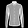

# Ruby Autoencoder

Toy autoencoder built with [torch-rb](https://github.com/ankane/torch.rb).

## Setup
[Setup torch rb](https://github.com/ankane/torch.rb?tab=readme-ov-file#installation) then
`bundle`.

## Train
Trains on the fashion mnist dataset.

```
bundle exec ruby train.rb
```

## Combine images
```
bundle exec ruby combine.rb pullover shirt
```

Available labels

- t_shirt
- trouser
- pullover
- dress
- coat
- sandal
- shirt
- sneaker
- bag
- ankle_boot

## Results
With 5 layers in encoder / decoder  
784 -> 512 -> 256 -> 128 -> 64 -> 32

### Combining embeddings
#### shirt + t_shirt
**shirt**


**t_shirt**


**combined**


### sandal + sneaker
**sandal**


**sneaker**


**combined**


### trouser + pullover
**trouser**


**pullover**


**combined**


## Reconstruction
### Shirt
**original**



**reconstructed**


## TODO
Try out a convolutional network for the auto encoder, should improve output
quality.
